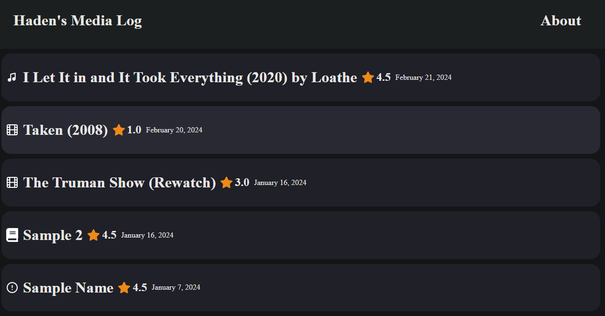
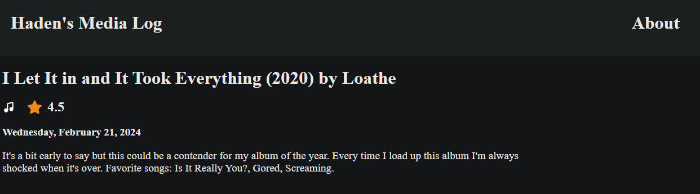
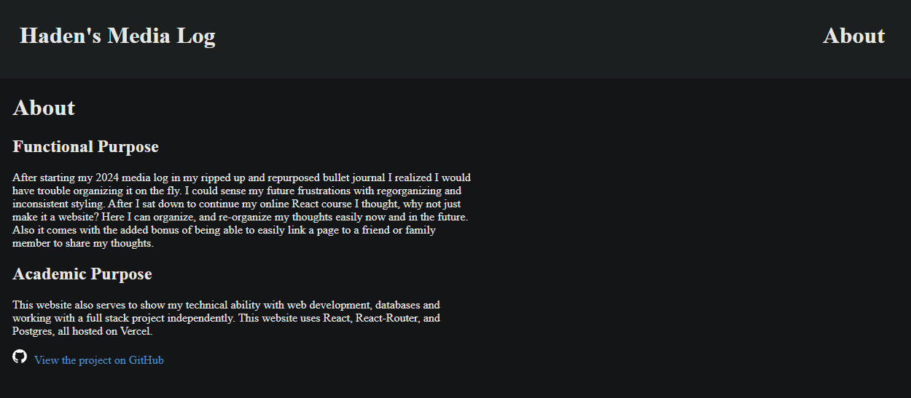

# Haden's Media Log

A simple personal media-log website, made using React and PostgreSQL hosted on Vercel.

## Functional Purpose

A website to organize, and re-organize my thoughts easily now and in the future. Also it comes with the added bonus of being able to easily link a page to a friend or family member to share my thoughts.

## Academic Purpose

This website also serves to show my technical ability with web development, databases and working with a full stack project independently. This website uses React, React-Router, and Postgres, all hosted on Vercel.

## Screenshots

